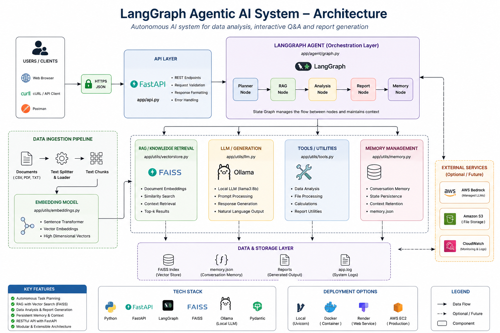

# 🚀 LangGraph Agentic AI System


---

## 🔥 Overview

A **production-style Agentic AI system** built using **LangGraph**, simulating real-world intelligent workflows with:

* 🧠 Multi-agent orchestration (Planner → Executor → Validator)
* ⚡ LLM-driven tool selection (dynamic, not rule-based)
* 🔁 Conditional routing with retry logic (failure recovery)
* 🔍 Semantic memory using FAISS (vector embeddings)
* 💾 Persistent memory (JSON-based)
* 📊 Logging & observability
* 🌐 API deployment via FastAPI

👉 Designed to reflect **real enterprise GenAI systems**, not demo notebooks.

---

## 🧠 Architecture

```
User Input
    ↓
Planner (LLM)
    ↓
Executor (LLM Tool Selection)
    ↓
Validator
    ↓
 ┌───────────────┐
 │   SUCCESS     │ → END
 └───────────────┘
         ↓
 ┌───────────────┐
 │   FAILURE     │ → Retry Loop
 └───────────────┘
```

---

## ⚙️ Core Features

### 🧩 Multi-Agent System

* Planner: Task decomposition
* Executor: Tool orchestration (LLM-driven)
* Validator: Execution validation

---

### 🔁 LangGraph Workflow

* State machine architecture
* Conditional edges (retry/fail)
* Production-style orchestration

---

### 🧠 LLM-Based Tool Selection

* Dynamic tool invocation
* No hardcoded rules
* Scalable design

---

### 🧬 Memory Systems

#### 📌 Structured Memory

* JSON-based persistence
* Stores tasks, plans, outcomes

#### 🔍 Vector Memory (FAISS)

* Embedding-based similarity search
* Retrieves relevant past tasks
* Enables **context-aware planning (RAG-like)**

---

### 📊 Logging & Observability

* Tracks full execution lifecycle
* Stored in `app.log`

---

### 🌐 API Layer

* Built using FastAPI
* Endpoint:

```
POST /run-agent
```

---

## 🛠️ Tech Stack

| Category      | Tools              |
| ------------- | ------------------ |
| LLM           | Ollama (Llama3)    |
| Orchestration | LangGraph          |
| Framework     | LangChain          |
| Vector DB     | FAISS              |
| Backend       | FastAPI            |
| Logging       | Python Logging     |
| Deployment    | Docker / AWS Ready |

---
---
## 🏗️ Architecture Diagram


---
---
## 📁 Project Structure

```
langgraph-agent-system/
│
├── app/
│   ├── agents/
│   ├── graph/
│   ├── tools/
│   ├── utils/
│   └── api.py
│
├── main.py
├── requirements.txt
├── Dockerfile
├── memory.json
├── app.log
└── README.md
```

---

## ▶️ Run Locally

### 1. Install dependencies

```
pip install -r requirements.txt
```

### 2. Start LLM

```
ollama run llama3:8b
```

### 3. Run API

```
uvicorn app.api:app --reload
```

### 4. Open UI

```
http://127.0.0.1:8000/docs
```

---

## 🔌 API Usage

### Request

```json
{
  "user_input": "Analyze sales data and generate report"
}
```

### Response

```json
{
  "plan": "...",
  "results": [...],
  "status": "SUCCESS",
  "retries": 0
}
```

---

## 🚀 Production Capabilities

* ✅ Agent orchestration (LangGraph)
* ✅ Retry logic & failure handling
* ✅ Vector memory (FAISS)
* ✅ API deployment
* ✅ Logging system
* ✅ Docker-ready

---

## 📈 Future Improvements

* AWS Bedrock integration
* CI/CD (GitHub Actions)
* Tool schema registry
* Multi-agent collaboration
* Monitoring dashboards

---

## 💡 Why This Project Stands Out

| Typical Projects | This Project        |
| ---------------- | ------------------- |
| Notebooks        | Full system         |
| Static pipelines | Agent orchestration |
| Basic RAG        | Memory + reasoning  |
| No deployment    | API + Docker        |

👉 Built to match **real industry systems**

---

## 👨‍💻 Author

**Tonumay Bhattacharya**

* AI/ML Engineer | GenAI Systems
* GitHub: https://github.com/tonumayworkspace-creator
* LinkedIn: https://linkedin.com/in/tonumay

---

## ⭐ Support

If this helped you:
👉 Star ⭐ the repo to support visibility

---

## 🎯 Recruiter Note

This project demonstrates:

* LangGraph orchestration
* Agentic AI architecture
* Production-ready GenAI system design

👉 Suitable for:

* AI Engineer
* GenAI Engineer
* Applied Scientist roles
